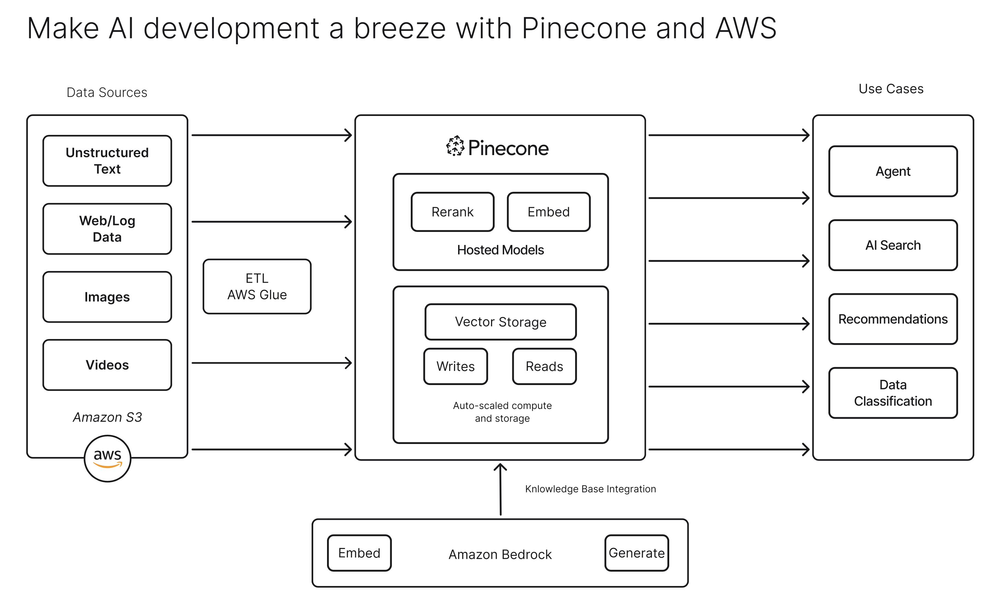
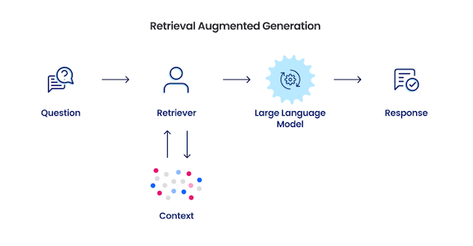

# About Pinecone
==

Pinecone is a cloud-native, SaaS-based vector database platform designed for managing and querying high-dimensional vector data, making it a key enabler for building machine learning, artificial intelligence, and data science applications.

The goal of this workshop is to provide participants with practical skills and hands-on experience in building AI applications using Pinecone and AWS. During the session, participants will:
- Learn the fundamentals of vector database concepts and Pinecone architecture.
- Gain hands-on experience building an end-to-end agentic retrieval-augmented generation (RAG) chat application using Pinecone, Amazon Bedrock, and Anthropic.

This workshop will enhance participants' knowledge of the latest AI concepts on Agentic AI and empower them to confidently implement the learnings to their business use cases.

# Pinecone with AWS
===

# What we're building today
==

Today, we'll build...
TODO

## Retrieval-augmented generation
Retrieval-augmented generation (RAG) is an architecture that provides the most relevant and contextually-important proprietary, private or dynamic data to your Generative AI application's large language model (LLM) when it is performing tasks to enhance its accuracy and performance.

RAG consists of three parts: a **data storage system**, a **data retrieval system** and an **augmented generation system**. The data storage system ingests all the source data into an external knowledge base. The retrieval system identifies relevant information from the external knowledge base, while the augmented generation system uses this retrieved data to provide more accurate and contextually appropriate responses.

RAG is particularly useful for chatbots, enabling them to connect to a company's knowledge base and deliver more informative and accurate answers.

Let's get started!

# Cost of Workshop
===

Because you are running this as part of a Pinecone-hosted event and in the AWS sandbox provided to you, then there is no cost for you.

## Running this workshop outside of the sandbox
If you choose to run this workshop with an existing Pinecone account or in your own AWS environment, you may incur costs for the Pinecone usage beyond the [Starter tier limits](https://www.pinecone.io/pricing/) and will incur costs for the AWS resources you launch and API calls you make to Amazon Bedrock. Costs vary based on which LLM model you select and more. We recommend that you check the official AWS pricing pages and monitor costs. You can use [AWS Pricing Calculator](https://calculator.aws/#/) for estimation.