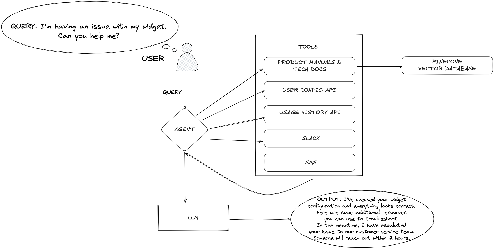

# About this workshop
==

In this workshop, you'll get practical skills and hands-on experience in building AI applications using Pinecone and AWS. You'll:
- learn the fundamentals of **vector database concepts**, **Pinecone architecture**, and the latest **concepts of Agentic AI**,
- **build an end-to-end agentic retrieval-augmented generation (RAG) chat app** using Pinecone, Amazon Bedrock, and Anthropic, and
- gain confidence to **implement your own business use cases**.

# About Pinecone
==

At Pinecone, we're building knowledgable AI. Pinecone is a cloud-native, SaaS-based vector database platform designed for managing and querying high-dimensional vector data, making it a key enabler for building machine learning, artificial intelligence, and data science applications.

# Pinecone with AWS
===

Here is a complete pipeline using a **Pinecone vector database** and **AWS services** for building intelligent applications.

- From various sources (text, web logs, images, videos), **data can be stored in Amazon S3**, **processed through AWS Glue ETL pipelines**, and **fed into Pinecone**.
- Pinecone provides **hosted embedding and reranking models** alongside **scalable vector storage** with read/write capabilities.
- **Integrates with Amazon Bedrock** for additional embedding and generation capabilities
- **Enables various use cases** like AI agents, semantic search, recommendation engines, and data classification through a unified knowledge base architecture.

# What we're building today
==

Today, we'll be building an end-to-end agentic retrieval-augmented generation (RAG) chat application to query financial statements. We'll use the 10-K filings of Comapaq company from 1994 to 2002, which are in text documents. We'll implement this pipeline using Pinecone, Amazon Bedrock, with Amazon Titan Text Embedding v2 model and Anthropic Claude 3 Haiku model for generation.

We'll cover the following modules:

1. Setup your Pinecone account, index, and API key
2. Load data into your Pinecone index
3. Query Pinecone and generate a response with simple RAG
4. Run multiple tools with agentic RAG
5. Play with the web-based agentic RAG chat app
6. Clean up

But first, let's review retrieval-augmented generation.

## Retrieval-augmented generation

Retrieval-augmented generation (RAG) is an architecture that provides the most relevant and contextually-important proprietary, private, or dynamic data to your application's large language model (LLM) when it is performing tasks to enhance its accuracy and performance.

RAG consists of four parts: **data ingestion**, **data retrieval**, an **augmented prompt**, and **generation**.

1. Ingestion: authoritative data like company proprietary data is loaded into a data source, like a Pinecone vector database
2. Retrieval: relevant data is retrieved from an external data source based on a user query
3. Augmentation: the retrieved data and the user query are combined into a prompt to provide the model with context for the generation step
4. Generation: the model generates output from the augmented prompt, using the context to drive a more accurate and relevant response.

RAG is particularly useful for chatbots, enabling them to connect to a company's knowledge base, to choose from various retrieval or action-based tools, and to deliver more informative and accurate answers.

Let's get started!

# Cost of Workshop
===

If you are running this as part of a Pinecone-hosted event, with a new Pinecone Starter plan account (which we'll create in the next module!), and in the AWS sandbox provided to you, then there is no cost for you.

## Running this workshop outside of the sandbox

If you choose to run this workshop with an existing Pinecone account or in your own AWS environment, you may incur costs for the Pinecone usage beyond the [Starter tier limits](https://www.pinecone.io/pricing/) and will incur costs for the AWS resources you launch in your account, and API calls you make to Amazon Bedrock. Costs vary based on which LLM model you select and more. We recommend that you check the official AWS pricing pages and monitor costs. You can use [AWS Pricing Calculator](https://calculator.aws/#/) for estimation.