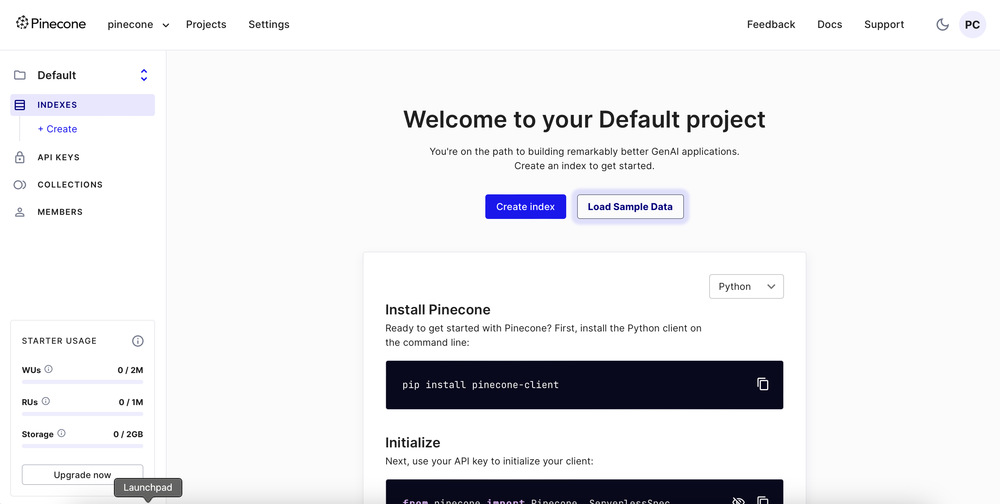

# 1. Create a Pinecone account
==
1. Open a new browser tab outside of Instruct and navigate to https://app.pinecone.io to create a new Pinecone account or to login.
2. Enter your email to login or create a new, free Pinecone account.
3. Once you've created your account, log in.
4. After logging in, you should see a page that looks just like this stunning screenshot:

# 2. Create a Pinecone index
==
Pinecone indexes are incredibly powerful tools that can handle billions of vectors while returning data at lightning-fast speeds and allowing for quick and efficient data upserting.

Let's dive in and create your first index! In this workshop, we'll do this in the Console, so you can familiarize yourself with it. Later in this workshop, we'll show you how to create an index through a Jupyter notebook as well.

1. Now that you have a Pinecone account, log in and look for the "Create Index" button right in the center of the screen. Click on it to start the magic!
2. Give your index the name `agentic-ai-with-bedrock`. This is the name of the index we'll use throughout this workshop.
3. In the Configuration section, select `Custom Settings` then select the `Dense` for Vector type and set the dimensions of your index to `1024`. This value determines the size of the vectors your index will handle.
4. Select the metric to `cosine`.
5. Select the `Serverless` option and leave the default Advanced settings as is.
6. Select the `us-east-1` region.
7. Finally, click on the "Create Index" button at the bottom to bring your index to life!

Watch in awe as your index is swiftly created, along with fascinating details about its configuration and creation speed. This is made possible by Pinecone's serverless option, which provides the best out-of-the-box experience, allowing you to scale to billions of vectors while still being cost-effective.

# 3. Create a Pinecone API key
==

TODO
Make sure to save this somewhere to use across notebooks, app

# Extra learning
==
## Cosine similarity

Cosine similarity is a widely used measure of similarity between two vectors in a multi-dimensional space. It calculates the cosine of the angle between the vectors, providing a value between -1 and 1. Cosine similarity is particularly useful in various applications, including machine learning, natural language processing, and information retrieval. It offers a measure of how alike two vectors are, focusing on their orientation rather than magnitude.

## Embedding model dimensions

Each embedding model has different dimensions because they are trained to capture different aspects and complexities of the input data. The dimensions of an embedding model determine the size of the vectors it generates. Higher-dimensional embeddings can capture more intricate patterns and relationships in the data, but they also require more computational resources. The choice of dimensions depends on the specific task, the complexity of the data, and the available computational resources. Common dimensions for embedding models range from a few hundred to several thousand.