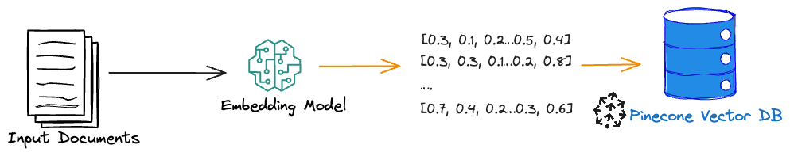

# Data ingestion
==
When working with large-scale text data, turning it into a searchable format is key to building efficient and intelligent applications.

- The process starts with parsing the source data to extract meaningful text, ensuring only relevant information is carried forward.
- Next, the text is semantically broken into smaller, manageable chunks and transformed into vector embeddings using an embedding model that captures their contextual meaning. These embeddings, essentially numerical representations of the text, make it easier for systems to understand and compare their content.
- Finally, the vector embeddings are uploaded into a Pinecone index, a high-performance vector database designed for fast and scalable similarity searches, enabling powerful, real-time query capabilities.

This pipeline is the foundation for building robust search and recommendation systems.



# Working with Jupyter notebooks
==

During this workshop, we'll be working through Jupyter notebooks written in Python. These notebooks are a combination of markdown and code cells.

- Markdown cells are used to provide context and instructions for the code cells.
- Code cells are used to execute the code.
- We'll use the `Python 3 (ipykernel)` kernel for the code cells throughout this workshop.
- You can run the code cells by clicking the `Run` button in the upper right of the cell, by clicking the `Shift + Enter` key combination, or by clicking the `Ctrl + Enter` key combination.

The first time you access the Jupyter tab, you'll be prompted to enter a token or password. To get the token, navigate to the [Terminal tab](tab-1) and run the following command:

```bash,run
jupyter server list | grep -o 'token=[a-f0-9]*' | sed 's/token=//'
```

Copy that token and paste it into the [Jupyter tab](tab-0) and log in. You should see the Jupyter dashboard with the files we'll use throughout this workshop. This should be the only time you need to do this, however if you're ever asked for a token again, you can follow these same instructions.

The data we'll load into Pinecone is located in the `data` folder. The notebooks we'll be working through are located in the `notebooks` folder.

# Building the data ingestion pipeline
==

The following notebook shows:
- how to parse the text data
- how to chunk the data
- how to use the AWS SDK for Python (Boto3) to convert data to vector embeddings via Amazon Bedrock
- how to upsert it to Pinecone

To load data into Pinecone:
1. Navigate to the [Jupyter tab](tab-0)
2. Open the notebook in the `notebooks` folder called `1_data_loading_pipeline.ipynb`
3. Select `Python 3 (ipykernel)` for the kernel in the upper right
4. Work through each cell in the notebook

Take some time to work through this notebook to load data into your Pinecone index, as in the next challenge you'll build the retrieval and augmentation steps.