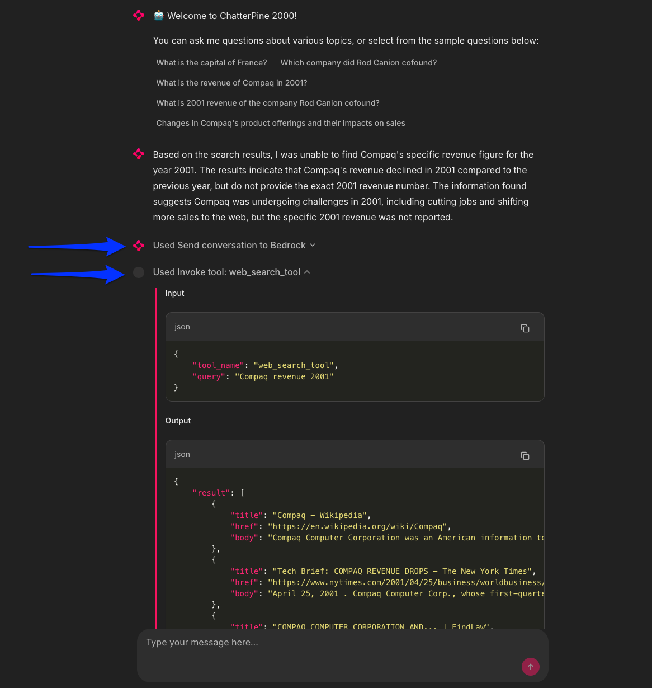

# TL;DR
==

In this module, you'll incorporate the agentic RAG pipeline, `run_agent`, from the last module and interact with it through a Chainlit web app chat interface.

# Building a web-based RAG chat app
==

Th `run_agent` function we used in the last module is the base for `rag_pipeline.py`. Remember that it does the following:

1. Sends the initial user query to the model through Amazon Bedrock
2. The model decides if it can answer or if it needs to use a tool and which tool to use
3. The `run_agent` function invokes any tools, if necessary
4. It then combines the tool response (search results) with the original user query to form the "context"
5. Finally, the context is sent back to the model to generate a response (or even to invoke another tool)
6. Optionally, the user continues to ask questions and this repeats, including the full conversation as "context"

# Run the app
==

➡️ Now, it's your turn! To get the app running, you'll need to set up a few bits.

## Setup .env file with your Pinecone API key

In the [IDE tab](tab-0), update the `.env` file with your `PINECONE_API_KEY` from earlier in this workshop.

Verify in this file that the Pinecone index name and namespace are the same as you used in the data loading module (they should be if you used all the defaults).

## Create the Python virtual environment

Now, create the Python virtual environment and install the dependencies. In the [Terminal tab](tab-1) run:

```bash,run
python -m venv .venv
source .venv/bin/activate
pip install -r requirements.txt
```

## Run the app

Now it's time to run the app:

```bash,run
python -m chainlit run app.py
```

When you see a message `Your app is available at http://localhost:8000`, the application is up and running. You can see it in the [ChatterPine 2000 tab](tab-2).

> [!WARNING]
> Chainlit app startup will print links to the application like:
>
> ```nocopy
> ➜ 2025-09-15 10:00:09 - Your app is available at http://localhost:8000
> ```
>
> ### DO NOT CLICK ON THOSE!
>
> They will try to open the app in your browser. However, the browser doesn't have direct access to the application running inside the workshop environment.


Head over to the [ChatterPine 2000 tab](tab-2) and ask some questions! Here are some example questions to ask:

- What is the capital of France?
- Which company did Rod Canion cofound?
- What is the revenue of Compaq in 2001?
- What is 2001 revenue of the company Rod Canion cofound?
- Changes in Compaq's product offerings and their impacts on sales

## Review the decisions, search results, and input/output

You can review the decisions, search results, and input/output in the webapp interface directly or more detail in the [Terminal tab](tab-1).



## Explore the code

Explore the code for the two tools you created in the last module (`pinecone_vector_search_tool.py` and `web_search_tool.py`) and the `run_agent` function in `rag_pipeline.py`.

In the next challenge, you'll clean up the resources you created in this workshop and then review what you learned.