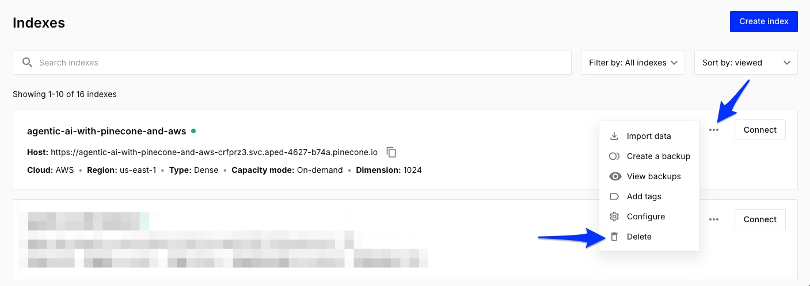

# TL;DR
==

In this module, you'll clean up the resources you created in this workshop and then review what you learned.

# Delete the Pinecone index
==
It's a good habit to **clean up unused resources when you are done** with them. Because you are running this as part of a Pinecone-hosted event and in the AWS sandbox provided to you, you do not need clean up any AWS resources. If you created a new Starter plan Pinecone acccount just for this workshop, you don't need to delete your Pinecone index, unless you want to. However, if you chose to use an existing Pinecone account outside the Starter plan, we recommend deleting the Pinecone index that was created during this workshop in order to prevent unforseen charges to your Pinecone account.

To delete the Pinecone index:
1. Navigate to the [Jupyter tab](tab-0)
2. Open the notebook in the `notebooks` folder called `4_clean_up.ipynb`
3. Select `Python 3 (ipykernel)` for the kernel in the upper right
4. Work through each cell in the notebook

Or through the Pinecone Console:
1. Navigate to the [Console](https://app.pinecone.io/organizations/-/projects/-/indexes)
2. Find the index you wish to delete
3. Select the `...` menu in the upper right of the index
4. Select the `Delete` menu item and confirm

# Wrapping up
==
In this workshop you learned:
- The fundamentals of vector databases and how to create intelligent, context-aware applications leveraging advanced techniques for semantic search and language modeling
- Understanding of the agentic RAG architecture and its applications, including information storage, retrieval and augmented text generation
- Hands-on experience with Pinecone's state-of-the-art vector database and AWS services for building and deploying AI solutions
- Best practices for integrating Pinecone and AWS services to create robust and scalable AI workflows

# Extra resources
==

We'd love to keep chatting with you after this workshop and as you continue your journey using Pinecone. Below are some resources to help you continue learning and building with Pinecone:

- Join the rest of the Pinecone community on Discord (ask your instructor for the link)
- [Grab this workshop, the data, and all the code on GitHub](https://github.com/pinecone-io/agentic-ai-with-pinecone-and-aws)
- [Read about the limitations of foundation models and how RAG can address them](https://www.pinecone.io/learn/retrieval-augmented-generation/)
- [Read why RAG is still relevant in 2025](https://www.pinecone.io/learn/rag-2025/)
- [Watch to learn about the secret to production-ready AI](https://youtu.be/buvRFJ-snAc)
- [Choose your chunking strategy](https://www.pinecone.io/learn/chunking-strategies/)
- [Work through more RAG notebooks featuring hybrid search, Anthropic, OpenAI, LangChain, and LangGraph](https://docs.pinecone.io/examples/notebooks#retrieval-augmented-generation-rag)

# Workshop complete! 🎉
==

Congratulations! You've successfully completed the Agentic AI with Pinecone and AWS workshop. You now have hands-on experience building intelligent applications with vector databases, RAG architectures, and cloud services.

We hope you enjoyed this journey and feel confident to continue building amazing AI applications with Pinecone.

Happy building!